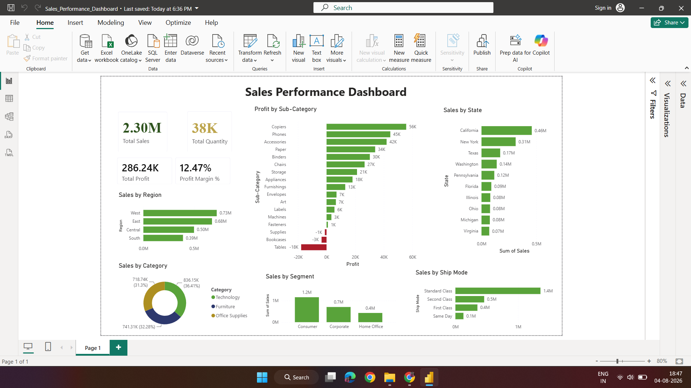

# 📊 Sales Performance Dashboard

A comprehensive **Sales Performance Dashboard** built using **Microsoft Excel, SQL, and Power BI** to analyze sales trends, profitability, customer behavior, and regional performance. This project transforms raw sales data into meaningful business insights through interactive visualizations and KPI tracking.

---

# 🚀 Project Overview

Businesses generate large volumes of sales data every day, but raw data alone doesn't support decision-making. This project demonstrates how data can be cleaned, analyzed, and visualized to uncover valuable insights.

The dashboard enables users to monitor business performance, identify profitable products, compare regional sales, and analyze trends over time.

---

# 🎯 Project Objectives

- Analyze overall sales and profit performance.
- Identify top-performing products and categories.
- Compare sales across different regions.
- Track monthly sales trends.
- Monitor key business KPIs.
- Build an interactive dashboard for business decision-making.

---

# 🛠️ Tools & Technologies

- Microsoft Excel
- SQL
- Power BI

---

# 📂 Dataset

**Dataset Used:** Sample Superstore Dataset

The dataset contains information about:

- Orders
- Customers
- Products
- Categories
- Sales
- Profit
- Discounts
- Shipping
- Regions

---

# 📈 Dashboard Features

- 📌 Total Sales KPI
- 💰 Total Profit KPI
- 📦 Total Orders
- 📊 Sales by Category
- 📉 Profit by Category
- 🌍 Regional Sales Analysis
- 🛒 Top Products
- 📅 Monthly Sales Trend
- 🎛️ Interactive Slicers and Filters

---

# 📊 Key Performance Indicators (KPIs)

- Total Sales
- Total Profit
- Total Orders
- Average Sales
- Profit Margin

---

# 🔍 Key Business Insights

- Identified the highest revenue-generating product categories.
- Compared profitability across different regions.
- Analyzed monthly sales growth patterns.
- Identified top-performing products.
- Highlighted opportunities to improve profitability.

---

# 📁 Project Structure

```text
Sales-Performance-Dashboard/
│
├── Dataset/
│   └── Sample-Superstore.csv
│
├── Excel/
│   └── Superstore_Working.xlsx
│
├── SQL/
│   └── Sales_Analysis.sql
│
├── PowerBI/
│   └── Sales_Performance_Dashboard.pbix
│
├── Images/
│   └── Dashboard.png
│
├── Documentation/
│
├── LICENSE
│
└── README.md
```

---

# 📷 Dashboard Preview



---

# 📌 Skills Demonstrated

- Data Cleaning
- Data Analysis
- SQL Query Writing
- Data Visualization
- Dashboard Design
- Business Intelligence
- KPI Reporting
- Analytical Thinking

---

# 📈 Future Enhancements

- Customer Segmentation Analysis
- Sales Forecasting
- Profit Prediction
- Advanced DAX Measures
- Drill-through Reports
- Dynamic KPI Cards

---

# 📄 License

This project is licensed under the MIT License.

---


## 🌟 Support

If you found this project helpful or interesting, please consider giving it a ⭐ on GitHub. Your support is greatly appreciated!

---

## 👩‍💻 Author

**Puja Kumari**

Aspiring Data Analyst | Excel | SQL | Power BI | Python

Thank you for visiting this repository! 😊

---

### 📫 Connect with Me

- 🔗 **GitHub:** [Puja17k2000](https://github.com/Puja17k2000)
- 💼 **LinkedIn:** [Puja Kumari](https://www.linkedin.com/in/puja-k-231227277/)
